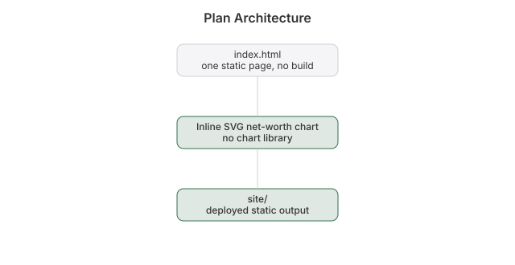

# Plan

 

I kept the next ten years in my head, then in a text file, then in a repo nobody could see. Now it's a page anyone can open: [plan.heyitsmejosh.com](https://plan.heyitsmejosh.com).

## The plan

School for computer science, then engineering. A business minor along the way, maybe a major in my late 30s. All of it inside my 30s.

| When | What |
|------|------|
| 2026 to 27 | Pre-Calculus 12 online through LECSS. The one admission gap. |
| 2027 to 31 | SFU Computing Science BSc, Burnaby. Calc and physics in year 1, Beedie Business minor declared end of year 2, co-op terms. |
| 2031 to 33 | Work as a developer, ideally fintech or trading infrastructure. Decide on the MSc Finance. |
| 2033 to 36 | Engineering: an SFU bridge or a professional master's, aiming at P.Eng eligibility. |
| Late 30s | Optional finance major or MSc Finance. Done before 40. |

Ruled out: UVic (not Lower Mainland), KPU (no real CS degree), BCIT (too vocational, closes the engineering door).

## The page

One HTML file. The hero is a ten-year time-lapse, one photo per chapter. Below it, the whole plan: school, the finance track, costs, funding, income while studying, salary bands, and an interactive net-worth chart. Drag the savings and return sliders, hover any year, or press the $1B, $100B and $1T buttons to see how long compounding takes when you are not Elon. It follows the portfolio's design tokens, so it looks like the rest of heyitsmejosh.com.

## Files

- `index.html` is the entire site.
- `roadmap.md` is what's still open.
- `wrangler.toml` deploys it as static assets on Cloudflare. `npx wrangler deploy`.

## Project map

[Technical whitepaper](WHITEPAPER.md)
